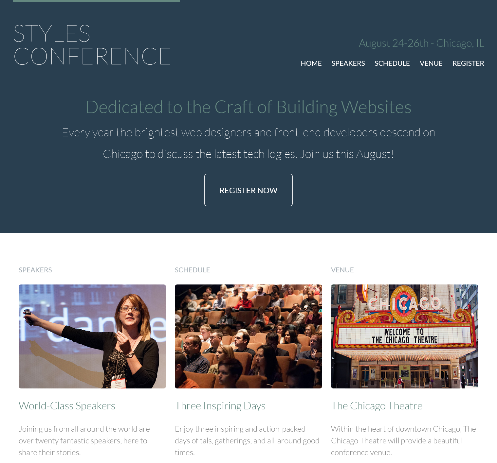

# Styles Conference

This is my first attempt in cloning webpage. I found this idea on this link: https://www.geeksforgeeks.org/top-10-projects-for-beginners-to-practice-html-and-css-skills/

I made some minor style changes from original and made it responsive with menu button for mobile version.

### Links

- Live Site URL: https://djole-zr.github.io/styled-conferences/

### Screenshot

